+++
date = '2025-09-09T21:38:18+08:00'
draft = true
title = 'Openwrt_install'
categories= ["tools"]
+++

# 小米AC2100 openwrt刷机记录-kwrt

记录本次openwrt固件教程，本教程为做完之后的总结。
本次教程用到的网站如下

```textile
# openwrt 官网
https://openwrt.org/toh/start 在这个页面查询你的硬件下载原始固件

# 更新固件下载地址
https://openwrt.ai/  在这里下载更新固件-kwrt,也可以定制

# passwal 依赖包
https://github.com/xiaorouji/openwrt-passwall/releases?page=3 # 科学上网需要用到

# breed 下载
https://breed.hackpascal.net/ 好像访问不了了
https://openwrtbreed.mysxl.cn/ 这个可以
https://www.right.com.cn/forum/thread-161906-1-1.html

# winscp工具
https://winscp.net/eng/download.php

# shell工具
这个无所谓 甚至powershell都可以

# 小米降级包，刷回包
https://www.xiaomi.cn/post/19184644 下载老版本固件 
https://www.miwifi.com/wap_download.html 下载刷回工具防止意外

```

## 一、准备工作-下载相应的固件

1. 进入openwrt官网下载过度包
2. 去kwrt下载升级包
3. 下载breed固件（这里我找的百度云盘）
4. 去passwall项目地址下载对应的passwall
5. 下载winscp工具
6. 下载老版本固件这里必须是2.0.7

## 二、刷回老版本

用网线将路由器的lan接口和电脑连接起来，小米路由器的管理后台地址为[http://192.168.31.1](https://cloud.tencent.com/developer/tools/blog-entry?target=http%3A%2F%2F192.168.31.1%2F&source=article&objectId=2046881),进入路由器web界面后，选择**常用设置**，再选择**系统状态**，然后选择**手动升级**。


点击**选择文件**，选择我们下载的小米降级固件V2.0.722，然后点击**开始升级**。


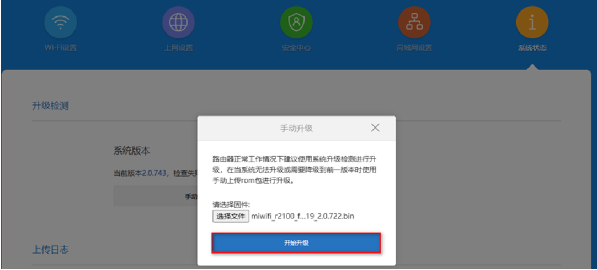

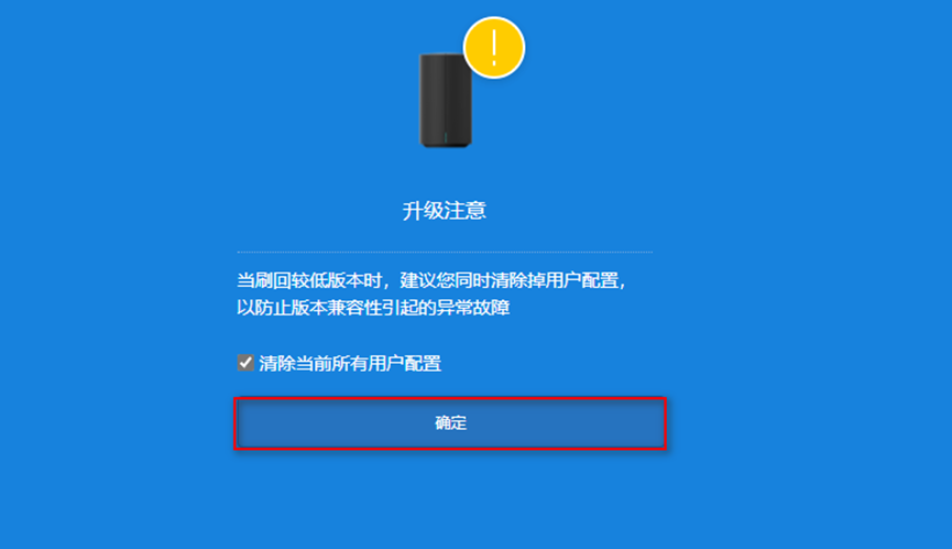

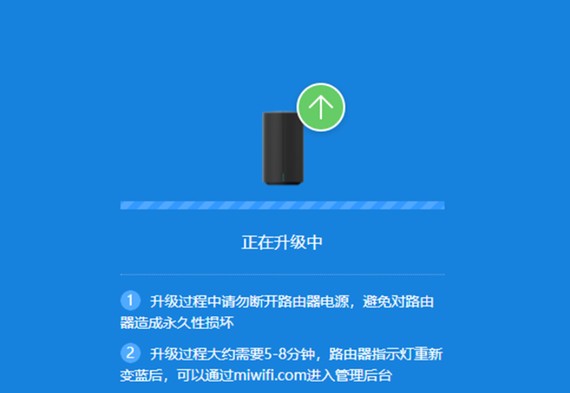

## 三、开启路由器SSH和修改root密码

1. 当你正常登录路由器后台后，查看你的地址栏，你会看到这种格式的链接，你现在需要记住这个的值，建议你单独拷贝到一个txt文本中，后续会用到这个STOK值。

```
[http://192.168.31.1/cgi-bin/luci/;stok=<STOK>/web/home#router](http://192.168.31.1/cgi-bin/luci/;stok=<STOK>/web/home#router)
```

然后按照以下顺序依次补全STOK的值并复制到浏览器中访问，若开启SSH和修改root密码，页面若提示`{"code":0}`,即代表成功。

```
http://192.168.31.1/cgi-bin/luci/;stok=<STOK>/api/misystem/set_config_iotdev?bssid=Xiaomi&user_id=longdike&ssid=-h%3B%20nvram%20set%20ssh_en%3D1%3B%20nvram%20commit%3B%20sed%20-i%20's%2Fchannel%3D.*%2Fchannel%3D%5C%22debug%5C%22%2Fg'%20%2Fetc%2Finit.d%2Fdropbear%3B%20%2Fetc%2Finit.d%2Fdropbear%20start%3B

```

```
http://192.168.31.1/cgi-bin/luci/;stok=<STOK>/api/misystem/set_config_iotdev?bssid=Xiaomi&user_id=longdike&ssid=-h%3B%20echo%20-e%20'admin%5Cnadmin'%20%7C%20passwd%20root%3B

```

## **四、导入breed固件文件**

打开WinSCP，我们在地址栏中填入`192.168.31.1`，端口填入`22`，协议选择`SCP`，用户名填入`root`，密码为`admin`，然后选择**保存**，选择好保存的会话，点击**登录**。

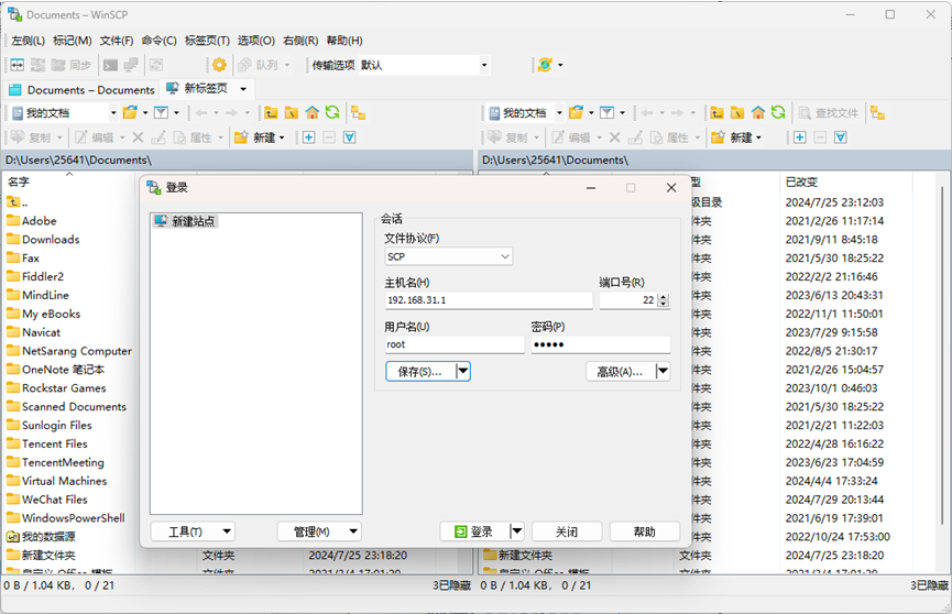

然后在右侧窗口内打开根目录中的Tmp文件夹，将我们下载的breed固件文件拖入（后缀为.bin），上传完成后关闭即可。

##### **通过SSH安装OpenWrt固件文件**

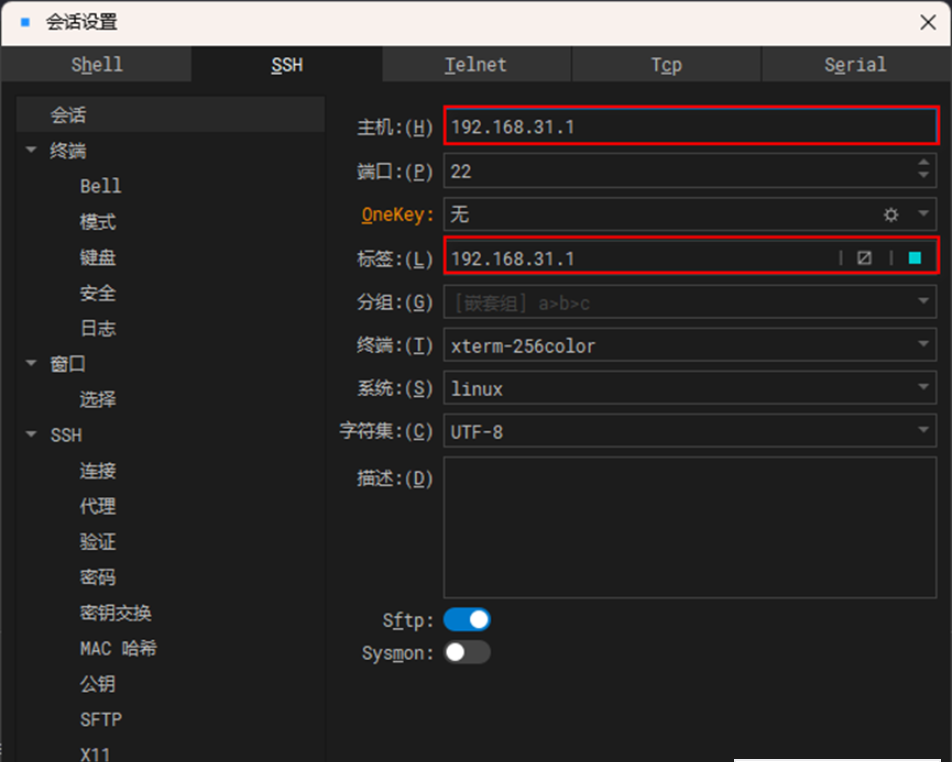

1. 然后依次执行以下命令来将固件刷入至路由器中

```
cd /tmp
nvram set uart_en=1&&nvram set bootdelay=5&&nvram set flag_try_sys1_failed=1&&nvram commit

```

2. 可以先备份一下，当然也不用备份，如果挂了，还是使用小米还原工具进行还原

```
cat /proc/mtd   #显示路由分区
dd if=/dev/mtd0 of=/tmp/all.bin   #备份所有分区到/tmp/all.bin
dd if=/dev/mtd1 of=/tmp/Bootloader.bin   #备份引导分区到/tmp/Bootloader.bin
```

3. 执行命令刷入breed

```
mtd -r write /tmp/breed-mt7621-pbr-m1.bin Bootloader
```

刷入之后就会重启了

## 五、进入breed web控制台

- 先将路由器断电，然后按着下面重置开关不要松开，然后插上电源，
- 观察指示灯，等待大概3秒左右，看到知识点两个红的闪烁，然后上面的蓝灯闪烁，这说明进入breed,
- 进入插上lan口与电脑相连，然后访问`192.168.1.1`

访问成功

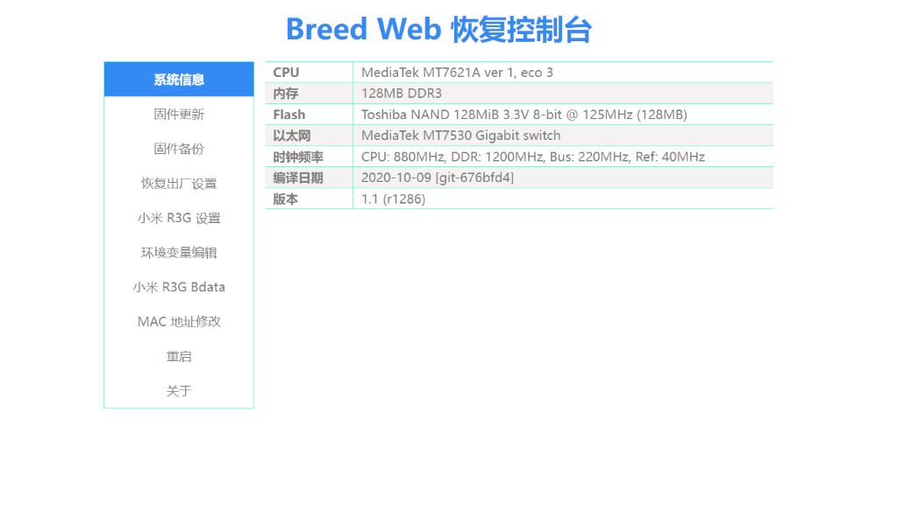

## 六、刷入openwrt过度包

- 在breed控制台，点击固件更新，
- 闪存布局选择openwrt那个
- 然后点击上传

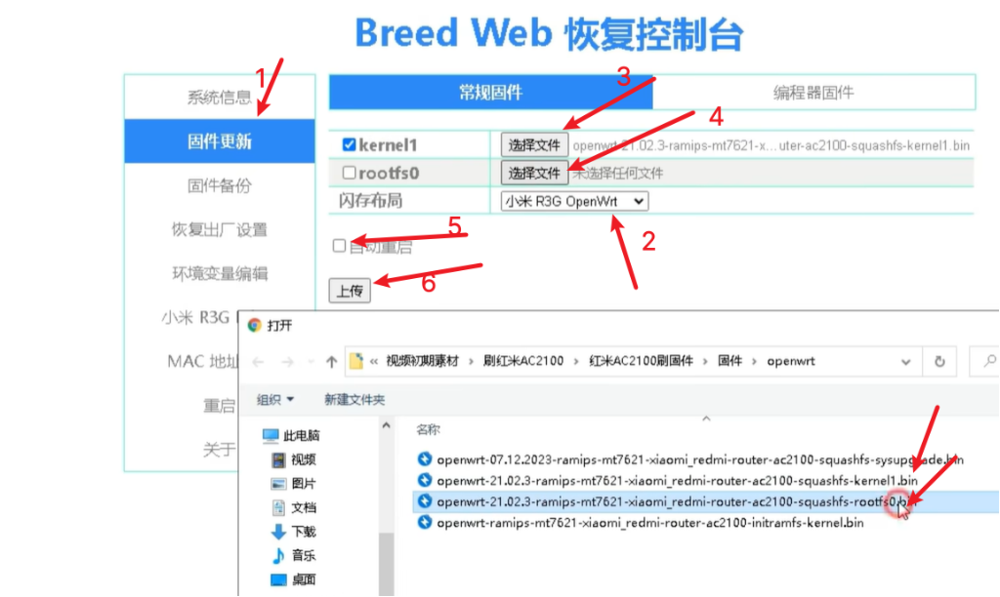

这里选择对应kernel 和root固件文件，点击上传

然后点击确定，breed就会刷入固件了。

## 七、刷入更新包

breed刷入之后重启路由器，然后访问

```
192.168.1.1
root
默认没有密码
```

这里就需要把冲kwrt下载的更新包刷入进去，因为官方下载的固件就是过度包而已，我们想要的功能还没有安装，页面也不好看，类似这种

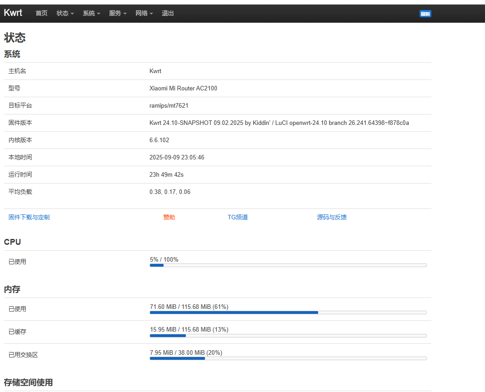

这里点击系统-->备份与升级


进入页面之后，在下面点击刷写新的固件，然后选择从kwrt下载的更新包就可以了

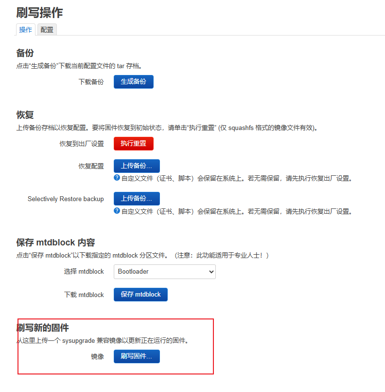

## 八、添加软件包

进入passwall项目地址，根据路由器的版本信息，下载对应版本的软件包

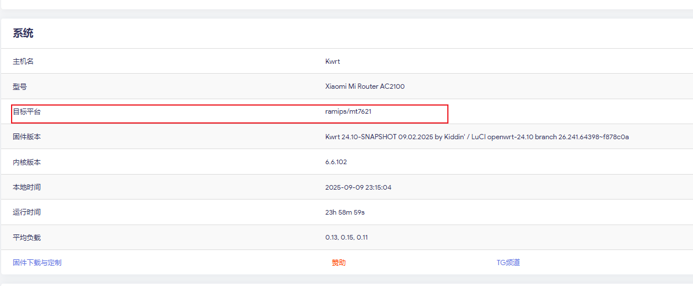

然后看是openwrt版本，这里用的是24.10

然后查看paswall的版本

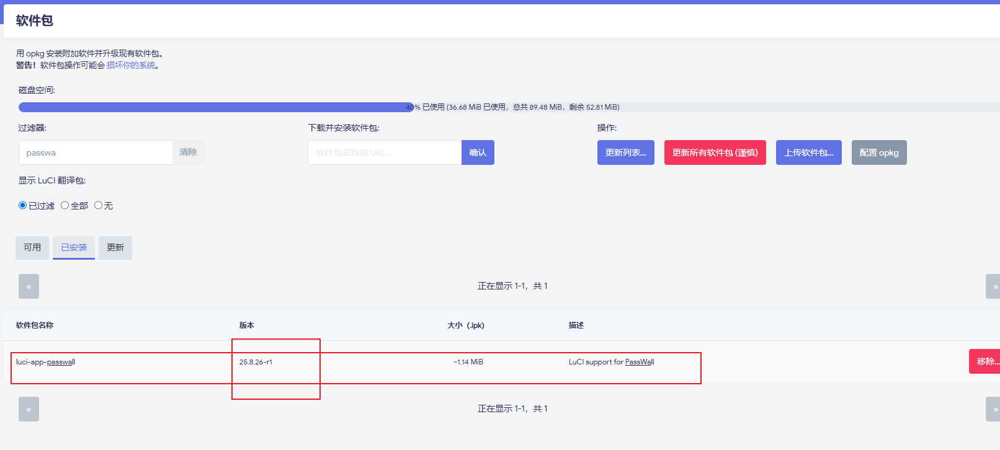

根据上面两个版本选择下载的缺少的依赖包

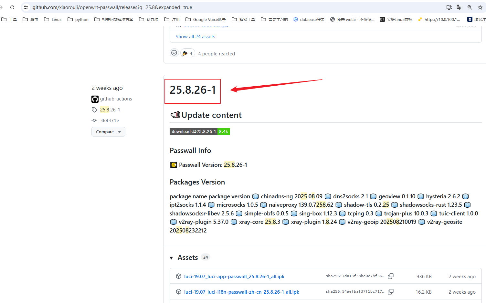

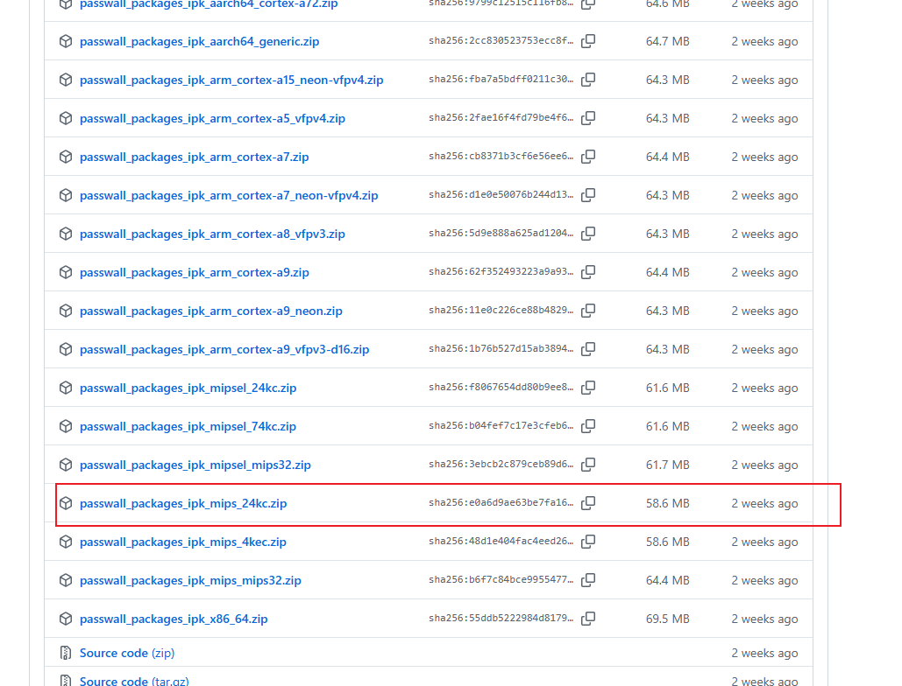

下载之后解压，然后查看里面的依赖包

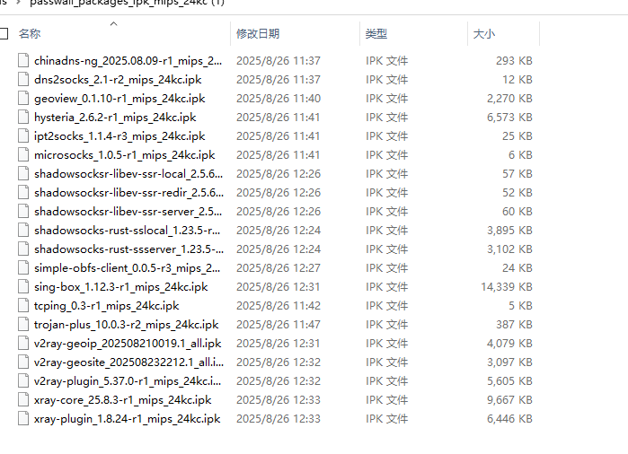

这些就是了。然后在软件包页面查看那个缺少删除安装哪个

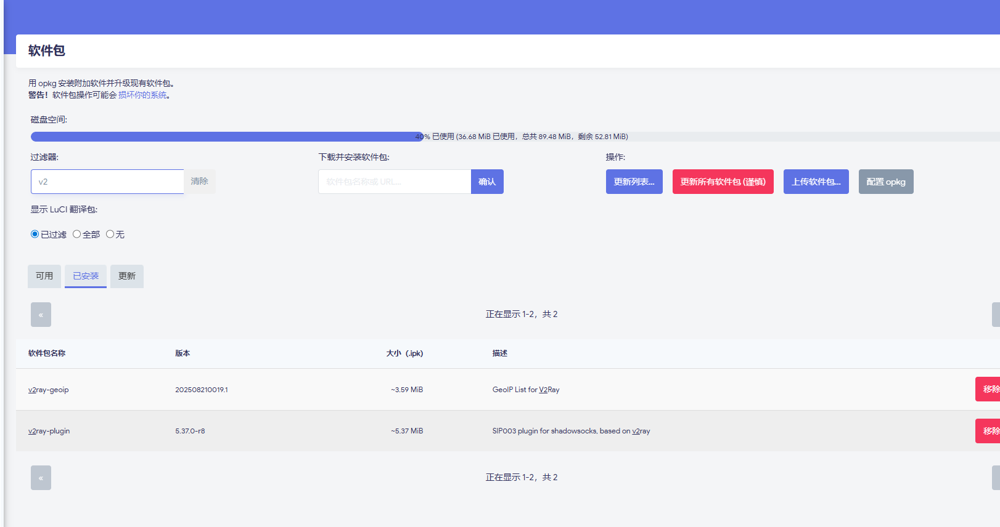

上面所有步骤完成，已经安装成功了， 可以进行配置科学上网啦

参考文章

- https://blog.csdn.net/2301_79558858/article/details/141572376
- https://www.cnblogs.com/smartlife/articles/17287957.html
- https://www.cnblogs.com/yecss/p/18432303
- https://blog.csdn.net/weixin_42373856/article/details/141037523
- https://www.right.com.cn/forum/thread-161906-1-1.html
- https://openwrt.org/zh/docs/guide-quick-start/starterfaq

 [小米ac2100教程.rar](openwrt_install.assets\小米ac2100教程.rar) 

